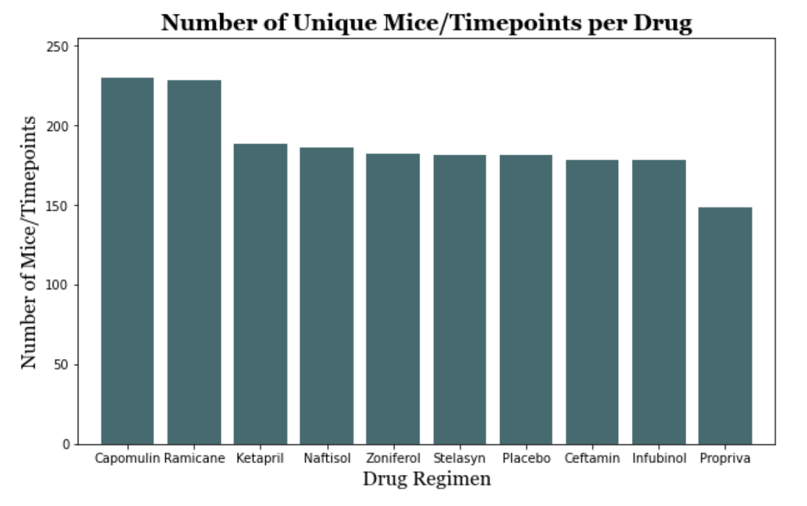
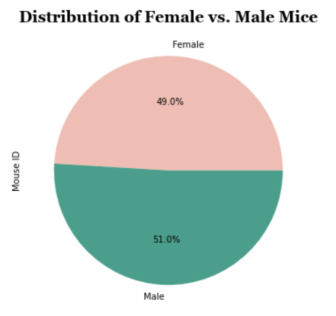
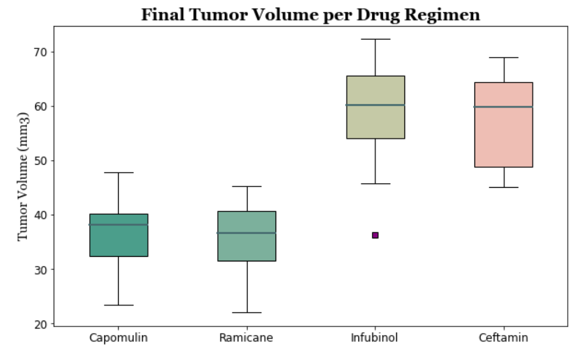
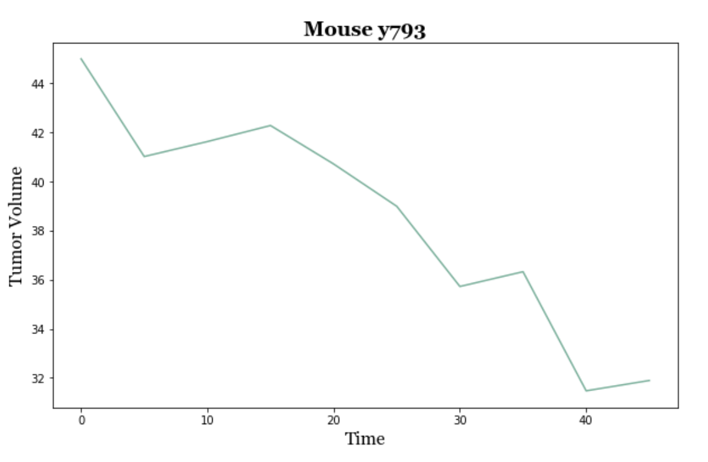
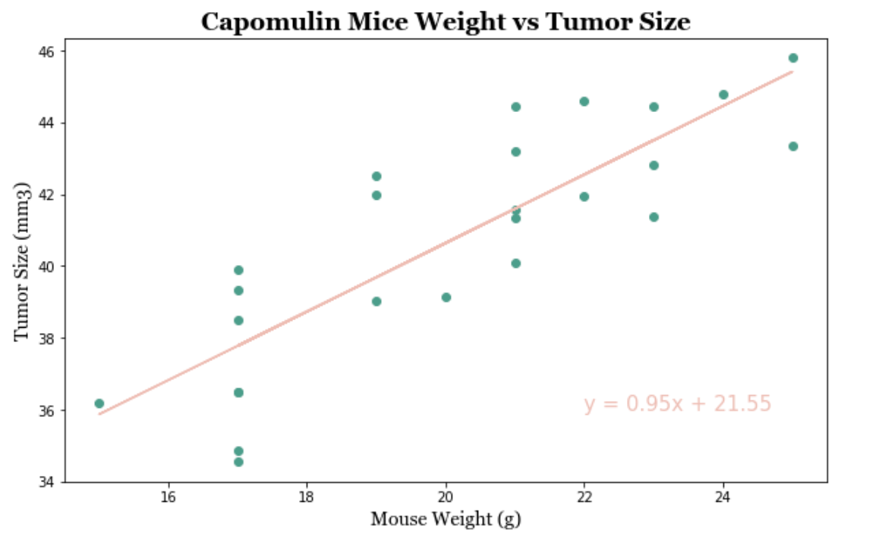

# The_Power_Of_Plots

## Background
Pymaceuticals Inc., a burgeoning pharmaceutical company based out of San Diego. Pymaceuticals specializes in anti-cancer pharmaceuticals. In its most recent efforts, it began screening for potential treatments for squamous cell carcinoma (SCC), a commonly occurring form of skin cancer.

In their most recent animal study, 249 mice identified with SCC tumor growth were treated through a variety of drug regimens. Over the course of 45 days, tumor development was observed and measured. The purpose of this study was to compare the performance of Pymaceuticals' drug of interest, Capomulin, versus the other treatment regimens.

## Technologies Used
- Matplotlib
- Python
- Pandas
- Jupyter Notebook

## Objectives
- Generate a summary statistics table consisting of the mean, median, variance, standard deviation, and SEM of the tumor volume for each drug regimen.

- Generate a bar plot using both Pandas's DataFrame.plot() and Matplotlib's pyplot that shows  the number of total mice for each treatment regimen throughout the course of the study.

- Generate a pie plot using both Pandas's DataFrame.plot() and Matplotlib's pyplot that shows the distribution of female or male mice in the study.

- Calculate the final tumor volume of each mouse across four of the most promising treatment regimens: Capomulin, Ramicane, Infubinol, and Ceftamin. 

- Calculate the quartiles and IQR and quantitatively determine if there are any potential outliers across all four treatment regimens.

- Using Matplotlib, generate a box and whisker plot of the final tumor volume for all four treatment regimens and highlight any potential outliers in the plot by changing their color and style.

- Select a mouse that was treated with Capomulin and generate a line plot of tumor volume vs. time point for that mouse.

- Generate a scatter plot of mouse weight versus average tumor volume for the Capomulin treatment regimen.

- Calculate the correlation coefficient and linear regression model between mouse weight and average tumor volume for the Capomulin treatment. Plot the linear regression model on top of the previous scatter plot.

## Observations
- Capomulin and Ramicane are the most effective drugreigmens in reducing the size of the tumors.
- Capomulin and Ramicane had the greatest number of timepoints throughout the study, highlighting the sample size of the group and the effectiveness of the treatment over time.
- There are more male mice per timepoints than female so it's interesting to note whether more females dies during the course of the study.

